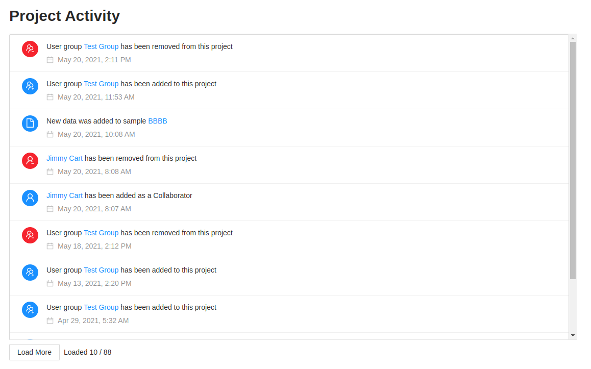
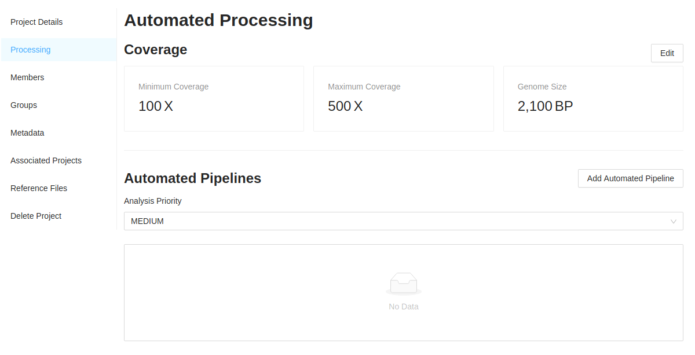
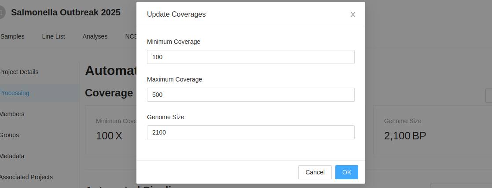
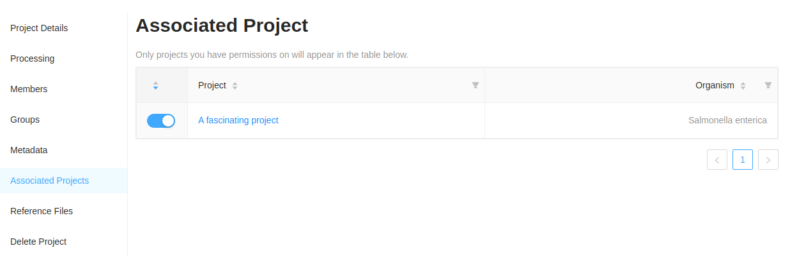
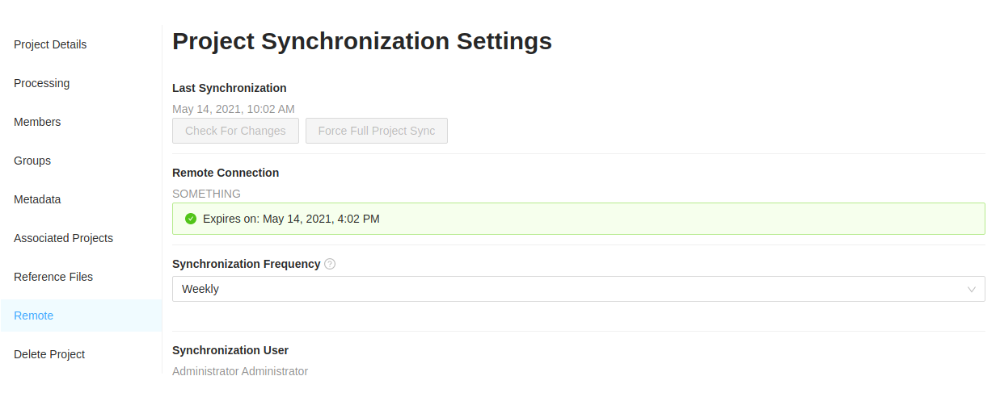
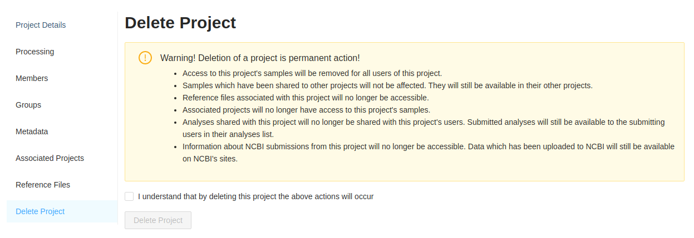
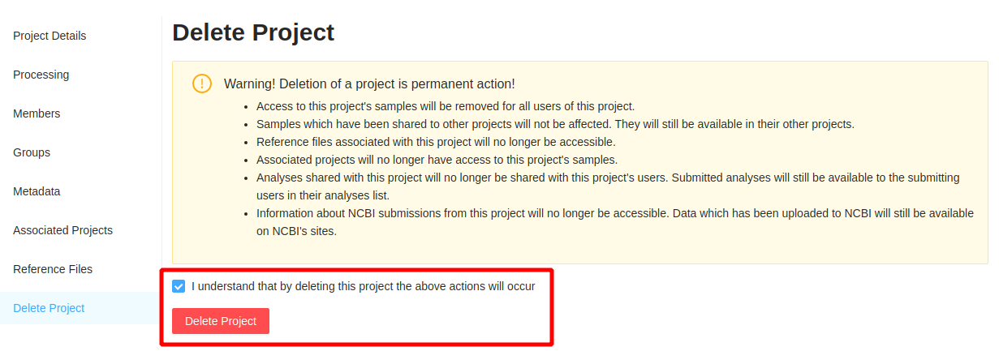

Managing Projects
=================
{:.no_toc}

The main organizational tool in IRIDA is the project. This section of the user guide descibes how you can view projects, edit project metadata (including uploading reference files), search for projects by name, and create new projects.

* This comment becomes the toc
{:toc}

Viewing existing projects
-------------------------

You can access the list of projects that you have permission to view and modify by clicking on the "Projects" menu at the top of the dashboard and selecting "Your Projects":

The projects list shows all projects that you are permitted to view or modify:

The projects list provides a high-level overview of project details, including:

* The IRIDA-generated identifier for the project,
* The name of the project,
* The project organism,
* The number of samples created in the project,
* The number of other user accounts with permissions to view or edit the project,
* The date that the project was created in IRIDA,
* The time that the project was last modified.

To enter into a project click the **Name** of the project:

Filtering and Searching the Projects Table
------------------------------------------

There are two ways to find a specific project in the projects table - filtering and searching.

### Searching

Search is always available in the text field directly above and to the right of the table.  This search across the project's id, name, and organism.

### Filtering

Pressing the Filter button opens a dialogue that allows you to filter on specific items within the project - the name and the organism.  Each filter only applies to its specific part of a project.

Example: filtering the name by "outbreak" and organism by "listeria" gives the following results:

You can see which filters are currently applied to the table under the filter button:

Clicking on the filters will clear that specific filter.

Creating a new project
----------------------



Viewing project samples
-----------------------

The project samples page provides a view of the samples that belong to the project.  To view the samples for a project, click on the **Samples** tab on the project page:

You can find out more about managing samples in a project by navigating to the [managing samples](../samples) section.

Project analysis results
------------------------

To view the results of an analysis that has been shared with a project, click the `Analysis` tab at the top of the project page. 

From this page you can view and monitor the progress of all analyses which have been shared with this project.  To view the results of an analysis click on the analysis name.  For more information on analysis results, see the [pipeline documentation page](../pipelines/#viewing-pipeline-results).

Project details
---------------

To view project details, click the **Details** tab on the project page:

 

This view will display basic information about the project such as:

* Project name - The given name of the project which will show up in the projects table.
* Project description - A general description of the project.
* Project organism - The organism expected to be stored within this project.
* Project Wiki URL - An external URL where users can go to view more details about the project.

 

To edit project details, from the project details page click on the "Edit" button:

The project details editing page provides the same form as when you [created the project](#creating-a-new-project), and all of the same descriptions apply. When you've finished editing the project details, you can click on the "Update" button at the bottom of the form.

Project NCBI Exports
--------------------

To view exports from this project to NCBI, click on the **NCBI Exports** tab.

 

For more information on exporting to NCBI, see the [documentation on the samples page](../samples/#ncbi-upload).

Viewing recent project activity
-------------------------------

Project data and metadata is changed over time. You can see a list of recent changes that have taken place by viewing the recent activity for a project.

Starting from [viewing project details](#viewing-project-details), you can view recent project activity by clicking on the "Recent Activity" tab at the top of the projects page:

Recent activities include adding or modifying project members and adding new samples to a project:

Managing project settings
-------------------------

If you are a manager on a project you can manage settings on individual projects.  These settings can be found in the **Settings** tab at the top of the project page.

### Processing

Project processing settings can be found in the **Processing** tab in the project settings page.

#### Automated pipelines

A project can be setup to automatically trigger the execution of a pipeline on upload of new data. The two pipelines available to be triggered are the [Assembly](../../tutorials/assembly/) pipeline (for bacterial genomes) and the [SISTR](../sistr/) pipeline (for typing of *Salmonella* genomes). This setting is enabled on a project-by-project basis and must be enabled by a project **manager**.

To enable an automated pipeline, check the *Automatically assemble data uploaded to project* or *Automatically type data uploaded to the project with SISTR* boxes.  Any new data uploaded to the project will now trigger the execution of the selected pipelines.

#### Project coverage

IRIDA can calculate the coverage of uploaded sequencing data for a sample.  To enable this a genome size and expected coverage must be set for a project in the project settings page.

* **Required Coverage** - The coverage expected by any sequencing data being uploaded to the project.
* **Genome Size** - The size of the genome of the organism being targeted by the project.

To edit coverage settings, click the `Edit` button.

You can then enter your coverage settings and click `Update`.

 

When these options are set IRIDA will flag any samples which do not meet the expected coverage requirement in the [project/samples list](../samples/#viewing-samples-in-a-project).  It will also display the coverage for a sample when you [view sequence files for a sample](../samples/#viewing-sequence-files).

### Project members

Project member settings can be found in the **Members** tab in the project settings page.

Project members are users who have permissions to view or edit project metadata. Project members can also view, download, and submit pipelines using sequencing data that's contained in a project. Project members can have two different roles: a project collaborator (*read-only* permissions), and a project manager (*read* and *modify* permissions).  A user must be a **Manager** on a project to add or remove members.

A project **Collaborator** will only be able to *view* the project members:

A project **Manager** will be able to *modify* the project members:

Similar to project members, user groups can also be added to projects to manage collections of users.

#### Adding a project member

##### Adding an individual project member



##### Adding a group project member



#### Changing a project member role

You may want to change a project member role if you wish to remove permissions for an individual user account to modify project details, but still want to allow that user account to view the project data. You can only change a project member role if you have the **Manager** role on the project.

Start by [viewing the project members](#project-members).

To change the role of a project member, click on the role drop-down menu of the user that you would like to change:

The project role is saved as soon as you make a selection -- you **do not** need to click a "Save" button.

#### Removing a user from a project

You may want to completely remove all permissions for a user to access data in a project. To remove those permissions, you must remove the user account from the project members list.

Start by [viewing the project members](#project-members).

To remove a project member, click on the remove button on the right-hand side of the table:

When you click the remove button, you will be asked to confirm the project member removal:

To confirm, click the "Ok" button.

### Associated Projects

Associated projects can be used to help manage related sample data across multiple projects.  Samples from associated projects can be viewed seamlessly with samples from the local project and used together in analysis pipelines.

To view associated projects click the **Associated Projects** tab in the project settings page.

#### Viewing associated projects

The "Associated Projects" list will display the projects associated with this project.  Projects in this view will be available in the ["Associated Projects" view on the project samples listing](../samples/#viewing-associated-samples).

#### Adding or removing associated projects

Project Managers can add or remove associated projects for a project.  From the "Associated Projects" page, click the "Edit" button.

**Note:** To add or remove a project to the list of associated projects, the manager must *at least* be able to read the data in the project to be added in the associated projects list.

You will be presented with a list of all projects you have access to in the local installation.  To add or remove an associated project, click the "On/Off" switch.

### Reference files

Reference files are required by at least one of the workflows that are installed in IRIDA by default. Reference files are stored on a project-by-project basis.

You can view or add reference files by clicking on the "Reference Files" tab in the project settings page.

You can upload a new reference file to the project by clicking on the "Upload Reference File" button:

Reference files **must** be in `fasta` format. Files containing **ambiguous base calls** will be rejected.

Once you've uploaded a reference file, you can optionally download the reference file (useful if someone else uploaded the reference file for the project) by clicking on the  download icon in the list of reference files.

### Remote project settings

Settings for remote synchronized projects can also be managed from the project settings page.  **Note:** these settings will only appear for synchronized projects, and will be available within the 'Remote' menu item.  

* **Last Synchronization** - The time the project was last synchronized or checked for updates.  Click the **Sync Now** button to mark the project for synchronization before it's scheduled sync time. 
* **Remote API** - Displays the remote IRIDA installation the project is hosted on and your connection status with that API.
* **Synchronization Frequency** - How often the project will be synchronized.  You can update this setting here.
* **Synchronization User** - The accout which will be used to request project updates from the remote IRIDA installation.  This user account must have access to the project on the remote IRIDA API in order for synchronization to proceed.  Click * **Become Synchronization User** to set this to be your user account.

Synchronizing a remote project
------------------------------

IRIDA allows you to synchronize projects between different IRIDA installations.  A remote project appears similar to a local project, but users are not allowed to add samples or sequencing data to a remote project.  Instead all data associated with a remote project will be pulled from a remote IRIDA API on a regular schedule.  The only data that can be managed for a remote project is the members that are allowed to view the project and associated sample data.

#### Connecting to a remote API

Before a remote project can be synchronized a connection must be set up between the IRIDA project host installation and the receiving IRIDA installation.  The connection between installations is handled by the IRIDA client and remote api connections.

First the IRIDA installation hosting the project must create a client which will be used to connect to the REST API.  The client must be created with a grant type of `authorization_code` and scope of `read`.  It is also recommended to enable refresh tokens for clients which will be involved in project synchronization.  Documentation on creating system clients can be found in the adminstrator guide's [managing system clients section](../../administrator/#managing-system-clients) and it must be performed by a system administrator.

Next the receiving IRIDA installation must set up a remote API connection to the hosting IRIDA site.  Information on adding a remote API connection can be found in the administrator guide's [adding a remote api section](../../administrator/#adding-a-remote-api) and must also be perfomed by an administrator.

#### Creating a remote synchronized project

Once the client and remote APIs have been created a user can create a synchronized project.  Note that in order to synchronize a remote project, a user must have login credentials to the host IRIDA installation and be a project member on the project they wish to synchronize.

To begin creating a synchronized project, click the **Synchronize Remote Project** option in the **Projects** menu. 

 

Once on the **Synchronize New Remote Project** page, you must select the required remote API and verify your connection status.  If you don't have a valid connection to the remote API you must click the `Connect` button and follow the instructions to connect to the remote API to proceed.  For more information on connecting to remote APIs see the [remote APIs documentation](../dashboard/#remote-apis).

Once you have connected to the remote API, you can select the project you wish to synchronize from the **Project** dropdown.  Here you wil be given a listing of all the projects you have access to on the remote IRIDA installation.  

After you have selected your project, you can select a synchronization frequency.  You should select a frequency that matches how often data will be added to the project.  This option can be updated later in the project settings panel.

The advanced section allows you to manually paste in an IRIDA project's REST URL rather than selecting it from the projects dropdown.  This option should only be used by advanced IRIDA users.

Once your project and an appropriate synchronization frequency have been selected, click the **Synchronize Project** button to create your project.

After the synchronized project has been created, you can view it's synchronization status at the top of the project's landing page.

The status section will be one of the following messages:

* `Marked for synchronization` - This project will be synchronized when the next project synchronization job runs.
* `Updating` - This project is currently being synchronized.
* `Synchronized` - This project is up to date since the last project synchronization job has been run.
* `Unauthorized` - The user who has created the synchronized project can no longer read the project on the host IRIDA installation.
* `Error` - An error occurred during the last project synchronization job.
* `Unsynchronized` - This project will no longer be synchronized.   

Deleting a project
------------------

Projects can be deleted from the **Delete Project** tab in the settings panel.

To delete a project, first read and understand the warning on the deletion page.  **Deleting a project is a permanent action!  Deleted projects and samples may not be able to be recovered.**  If you are sure you want to delete the project, check the confirmation box, then click **Delete Project**.  Once the project has been successfully deleted you will be redirected to your list of projects.

<a href="../user-groups/">Previous: Managing user groups</a><a href="../samples/" style="float: right;">Next: Managing samples</a>
